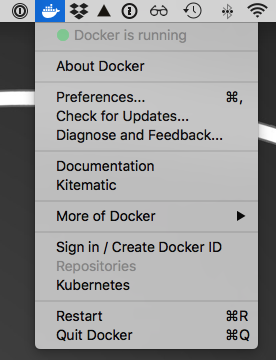
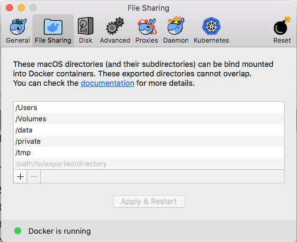
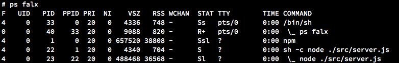
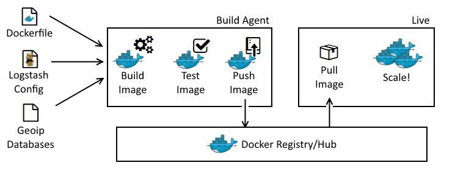

# Docker for JS Developers

#### Use the power of docker to your advantage

<small>by Peter Cosemans</small>
<br>
<br>
<small>
v1.0
</small>
<br>
<small>
Copyright (c) 2018 Euricom nv. Licensed under the [MIT license](https://opensource.org/licenses/MIT).
</small>

<!-- markdownlint-disable -->
<br>
<style type="text/css">
.reveal section img {
    background:none;
    border:none;
    box-shadow:none;
}
.reveal ul li {
    font-size: 2.0em;
    margin: 0px;
    line-height: 0;
}

.reveal h1 {
font-size: 3.0em;
}

.reveal h2 {
font-size: 2.00em;
}
.reveal h3 {
font-size: 1.50em;
}
.reveal p {
font-size: 70%;
}
.reveal blockquote {
font-size: 100%;
}
.reveal pre code {
display: block;
padding: 5px;
overflow: auto;
max-height: 800px;
word-wrap: normal;
font-size: 100%;
}
</style>

---

# Setup docker

### for MacOS

Follow this link: [https://docs.docker.com/docker-for-mac/install](https://docs.docker.com/docker-for-mac/install)

Docker is started automatically.



<prettier-ignore>
***

## File sharing

```
sudo mkdir -p /data/docker
sudo chown $USER /data/docker
```

Add File Sharing (for MacOS)



---

# Use docker to run services

> Extend your development toolbox

<prettier-ignore>
***

## Run mongoDB from docker

Create container & run

```bash
# mongodb 3.6
docker run --publish 27017:27017 \
    --name mongodb \
    --volume /data/docker/mongo-3.6:/bitnami \
    --rm \
    bitnami/mongodb:3.6
```

Connect DB with shell

```bash
$ docker exec -it mongodb mongo
MongoDB shell version v3.6.2
connecting to: mongodb://127.0.0.1:27017/localhost
MongoDB server version: 3.6.6
>
```

Restart

```bash
docker start mongodb
```

---

# Dockerizing a Node.js app

> You app in docker

<prettier-ignore>
***

## A mini application

```js
const http = require('http');
const fs = require('fs');

http
  .createServer((req, res) => {
    res.writeHead(200, { 'Content-Type': 'text/html' });
    res.end(`<h1>Hello from NodeJS</h1>`);
  })
  .listen(8080);
```

## Dockerizing Node.js

Dockerfile

```docker
FROM node
RUN mkdir -p /app
COPY index.js /app
EXPOSE 8080
CMD [ "node", "/app/index" ]
```

build it

```bash
docker build -t node-app .
```

and run it

```bash
docker run -p 8081:8080 -d node-app # deamon
docker run -p 8081:8080 -it node-app # interactive
```

<prettier-ignore>
***

## Create NodeJS app with dependencies

A more real live application with Express

```json
{
  "name": "node-express",
  "version": "1.0.1",
  "scripts": {
    "start": "node ./src/server.js",
    "start:debug": "nodemon ./src/server.js",
    "lint": "eslint \"**/*.js\"",
    "docker:build": "docker build -t node-express .",
    "docker:run": "docker run -p 8081:8080 -d node-express"
  },
  "dependencies": {
    "express": "^4.16.3"
  },
  "devDependencies": {
    "eslint": "^4.19.1",
    "eslint-config-airbnb-base": "^12.1.0",
    "eslint-config-prettier": "^2.9.0",
    "eslint-plugin-import": "^2.12.0",
    "nodemon": "^1.17.5",
    "prettier": "^1.6.1"
  }
}
```

<prettier-ignore>
***

## Dockerize the NodeJS application

```docker
# Dockerfile
FROM node

# Create app directory
WORKDIR /app

# Install app dependencies
COPY package*.json /app/
ENV NPM_CONFIG_LOGLEVEL warn
RUN npm install --production --quiet

# Bundle app source
COPY . /app

# Start app
CMD [ "npm", "start" ]
EXPOSE 8080
```

<prettier-ignore>
***

## Dockerize the application

Only include files you really want with `.dockerignore`

```docker
# Ignore everything
**

# Allow files and directories
!package.json
!yarn.lock
!/src/**

# Ignore unnecessary files inside allowed directories
# This should go after the allowed directories
**/*~
**/*.log
**/.DS_Store
**/Thumbs.db
```

---

## Minimize your image size

> Make it small

<prettier-ignore>
***

## Which base image?

| name                   | Linux  | remark              | size  |
| ---------------------- | ------ | ------------------- | ----- |
| node                   | Debian | latest (inc tools)  | 673MB |
| node:6                 | Debian | latest v6 (6.14.4)  | 659MB |
| node:slim              | Debian | less tools          | 183MB |
| node:8-slim            | Debian | less tools & v8     |       |
| node:alpine            | Alpine | optimized for node  | 69 MB |
| mhart/alpine-node      | Alpine | latest (npm & yarn) | 68 MB |
| mhart/alpine-node:base | Alpine | latest              | 42 MB |

```
$ docker run mhart/alpine-node:10 node --version
v10.11.0
```

See [https://hub.docker.com/r/mhart/alpine-node/](https://hub.docker.com/r/mhart/alpine-node/)

<prettier-ignore>
***

## Multi-stage builds

Using minimal node.js image, yarn and multi-stage builds

```docker
# Do the npm install or yarn install in the full image
FROM mhart/alpine-node:8 as builder
WORKDIR /app
COPY package.json yarn.lock ./
RUN yarn install --production

# And then copy over node_modules, etc from that stage to
# the smaller base image
FROM mhart/alpine-node:base-8
WORKDIR /app
COPY --from=builder /app .
COPY ./src /app/src

EXPOSE 8080
CMD ["node", "src/server.js"]
```

---

## HEALTHCHECK

> Monitor your docker image

<prettier-ignore>
***

## HEALTHCHECK

Docker provide a native health check (> 1.12)

```
# Dockerfile
FROM mhart/alpine-node

...

# check every 30s to ensure this service returns HTTP 200
HEALTHCHECK --interval=30s CMD node healthcheck.js

# Start app
CMD [ "npm", "start" ]
```

Status

```
CONTAINER ID  IMAGE    COMMAND      STATUS
7f98cf0d23ae  health   "npm start"  Up 30 seconds (healthy)
```

---

# Gracefull Shutdown

> We can speak about the graceful shutdown of our application, when all of the resources it used and all of the traffic and/or data processing what it handled are closed and released properly.

<prettier-ignore>
***

## Long running request

A small simulation

```js
app.get('/wait', (req, res) => {
  const timeout = 5;
  console.log(`received request, waiting ${timeout} seconds`);
  setTimeout(() => {
    res.send({
      id: Date.now(),
      message: 'Hello belated world',
    });
  }, timeout * 1000);
});
```

If you stop the nodeJS server (ctrl-C or kill) before the request is finished.

```bash
$ curl http://localhost:8080/wait
curl: (52) Empty reply from server
```

<prettier-ignore>
***

## Gracefull Shutdown

React to sigint & sigterm to handle shutdown of the server

```js
const shutdown = signal => {
  console.log('shutdown by', signal);
  httpServer.close(err => {
    console.log(`  server stopped by ${signal}`);
    process.exit(err ? 1 : 0);
  });
};

process.on('SIGINT', () => shutdown('SIGINT')); // ctrl-c
process.on('SIGTERM', () => shutdown('SIGTERM')); // kill
```

Limit Keep Alive

```js
const httpServer = app.listen(8080, () => {
  // limit keep alive to 6sec
  httpServer.timeout = 6000;
});
```

<prettier-ignore>
***

## Run in docker

Build and run

```bash
docker build -t node-express-shutdown .
docker run -p 8080:80 --rm --name=expressShutdown node-express-shutdown
```

Stop container

```bash
docker stop expressShutdown
```

---> BAD: We don't see any signal handling <---

<prettier-ignore>
***

## Signal processing in docker

Lets look at the process tree.

```
$ docker exec -it expressShutdown /bin/sh
> ps falx
```



<prettier-ignore>
***

## Gracefull Docker Shutdown

To shutdown gracefully

```docker
# Don't start with npm
# Always start node process directly
CMD [ "node", "src/server.js" ]
```

Stop with timeout

```bash
# stop container with 30 timeout before sending KILL
docker stop expressShutdown --time 30
```

Build, run & shutdown

```bash
$ docker run -p 8080:80 --rm --name=expressShutdown node-express-shutdown
Shutdown by SIGTERM
  server stopped.
```

---

# Cluster node applications

> Set up high availability

<prettier-ignore>
***

# Clustering with PM2

> High available application


<prettier-ignore>
***

## Setup, Config and Run PM2

Install

```bash
# install
npm install pm2 -g
```

Config

```js
# ecosystem.config.js
module.exports = {
  apps : [{
    name      : 'API',
    script    : './src/server.js',
    instances: "auto",
    kill_timeout: 10000,
    instance_var: 'PM2_INSTANCE_ID',
    exec_mode: 'cluster',
  }],
};
```

Startup & monitor

```bash
# Start PM2 demon
pm2 start

# Other commands
pm2 status
pm2 logs
```

<prettier-ignore>
***

## Running PM2 in docker

```docker
# Dockerfile
FROM keymetrics/pm2:latest-alpine

# Create app directory
WORKDIR /app

# Install app dependencies
COPY package*.json /app/
COPY ecosystem.config.js /app/
RUN npm install --production --quiet

# Bundle app source
COPY . /app/

# Start app
CMD [ "pm2-runtime", "start", "ecosystem.config.js" ]

EXPOSE 8080
```

<prettier-ignore>
***

## Usefull PM2 commands

Usefull commands

```bash
# Listing managed processes
$ docker exec -it <container-id> pm2 list

# Monitoring CPU/Usage of each process
$ docker exec -it <container-id> pm2 monit
```

---

## Load Balancing with NGINX

### Multiple docker images

Let's configure an instance of NGINX to load balance requests between different docker instances.


<prettier-ignore>
***

## NGINX

[Nginx](https://www.nginx.com/) is a high performance load balancer.

nginx.conf

```
server {
  listen 80;

  location / {
    proxy_pass http://node-app;
  }
}

upstream node-app {
    server node1:3000 weight=10 max_fails=3 fail_timeout=30s;
    server node2:3000 weight=10 max_fails=3 fail_timeout=30s;
}
```

<prettier-ignore>
***

## Dockerize NGINX

Dockerfile

```
FROM nginx
RUN rm /etc/nginx/conf.d/default.conf
COPY nginx.conf /etc/nginx/conf.d/default.conf
```

<prettier-ignore>
***

## Docker-compose

Compose is a tool for defining and running multi-container Docker applications.

```docker
version: '2'
services:
  nginx:
    build: ./nginx
    ports:
    - "8080:80"
    depends_on:
    - node1
    - node2
  node1:
    build: .
    depends_on:
    - mongo
    environment:
      MONGO_URL: mongodb://mongo/todoDemo
  node2:
    build: .
    depends_on:
    - mongo
    environment:
      MONGO_URL: mongodb://mongo/todoDemo
  mongo:
    image: mongo:3.2
    volumes:
    - ./.mongo-data:/data/db
```

<prettier-ignore>
***

## Compose: build and run

```bash
# build all docker images defined in the docker-compose file
$ docker-compose build

# startup docker cluster
$ docker-compose up
```

---

# Deploy



<prettier-ignore>
***

## Push image to registry

```bash
# login to dockerhub: https://hub.docker.com/
docker login

# tag (label) image
docker tag my-image euri/my-image:1.0.0 .
docker build -t euri/my-image:1.0.0 .

# push to repository
docker push euri/my-image:1.0.0
```

<prettier-ignore>
***

## Simple Deployment

- Azure Container Instances

- Heroku Docker

- AWS Fargate

- Other (Sloppy.io, Hyper.sh, ...)

- Or custom ([scaleway.com](https://www.scaleway.com/imagehub/docker/), ...)

<prettier-ignore>
***

## Azure Container Instances

```bash
# Create resource group
az group create --name timACI --location northeurope
```

```bash
# Create container
az container create --name euritest \
    --image euri/my-image:1.0.0 \
    --resource-group timACI --ip-address public --port 3000

# Start container
az container show --name euritest --resource-group timACI
```

```bash
# Delete container
az container delete --name euritest --resource-group timACI
```

<prettier-ignore>
***

## Continuous Integration

- CircleCI: build & test image

- Azure DevOps (VSTS)

- GitLab Continuous Integration

<prettier-ignore>
***

## CircleCI

| Base Image | Service Image | Tools   |
| ---------- | ------------- | ------- |
| Node       | MongoDB       | curl    |
| JRuby      | MySQL         | git     |
| Go         | PostgresSQL   | zip/tar |
| PHP        | ...           | docker  |
| ...        | ...           | jq      |
| Custom     | Custom        | apt-get |

build config

```
version: 2
jobs:
  build:
    docker:
      - image: circleci/node:10
      - image: mongo:3.4.4
```

<prettier-ignore>
***

## Scale, High available and orchestrate containers

- Azure Container Service

- AWS Elastic Container Service (ECS)

- Google Container Engine

---

# Cool, great I want a container


> Are you sure?

<prettier-ignore>
***

# Yes

- Development support (local, build systems)

- Existing container orchestration

- Need for special toolset

<prettier-ignore>
***

# No

- Static Website

- Simple NodeJS App

---

# Appendix

> Good to know

<prettier-ignore>
***

## Best practices for writing Dockerfiles

- Use a .dockerignore file

- Use multi-stage builds

- Avoid installing unnecessary packages

- Each container should have only one concern (one process per container)

- Minimize the number of layers

<prettier-ignore>
***

## Usefull Docker Commands

```bash
# Docker build
docker build -t node-app .
docker build -t namespace/app:1.1.0 .
```

```bash
# List all images
docker images

# List all running containers
docker ps

# List all containers
docker ps -a
```

```bash
# Run
docker run -p 8080:80 <image>
docker run -p 8080:80 --name myCoolApp <image>
docker run -p 8080:80 --env "NODE_ENV=production" <image>
```

```bash
# Stop all containers
docker stop $(docker ps -a -q)

# Remove all containers
docker rm $(docker ps -a -q)

# Remove/delete all images
docker rmi -f $(docker images -q)

# Stop (and after 10sec kill) a running container
docker stop <container-id or name>
docker stop -f <container-id  or name>
```

<prettier-ignore>
***

## Usefull Docker Commands

```bash
# Run interactive
docker run -it <image-name>

# Run interactive with shell
docker run -it --entrypoint bash <image-name>

# Run interactive on running container
docker exec -it <container-id> /bin/bash
```

```bash
# Login
docker login

# Push to docker hub
docker push <namespace>/<image-name>:<tag>
docker push euri/myCoolApp:1.0.0
```

```bash
# Stop and remove all stuff (containers, images, cache, ...)
docker system prune --all
```

<prettier-ignore>
***

# Resources

- [Using Yarn with Docker](https://hackernoon.com/using-yarn-with-docker-c116ad289d56)

- [Why we switched from docker to serverless](https://serverless.com/blog/why-we-switched-from-docker-to-serverless/)

- [Load Balancing Node.js Applications with NGINX and Docker](https://auth0.com/blog/load-balancing-nodejs-applications-with-nginx-and-docker/)

- [Best practices for writing Dockerfiles](https://docs.docker.com/v17.09/engine/userguide/eng-image/dockerfile_best-practices)

- [Using PM2 with Docker](https://pm2.io/doc/en/runtime/integration/docker/?utm_source=pm2&utm_medium=website&utm_campaign=rebranding)

<prettier-ignore>
***

# Resources

- [Building Graceful Node Applications in Docker](https://medium.com/@becintec/building-graceful-node-applications-in-docker-4d2cd4d5d392)

- [How To Prevent Your Node JS Process From Crashing](https://medium.com/dailyjs/how-to-prevent-your-node-js-process-from-crashing-5d40247b8ab2)

- [How to write faster, leaner Dockerfiles for Node with Yarn and Alpine](https://medium.com/@iamnayr/a-multi-part-analysis-of-node-docker-image-sizes-using-yarn-vs-traditional-npm-2c20f034c08f)

- [https://medium.com/@gchudnov/trapping-signals-in-docker-containers-7a57fdda7d86](https://medium.com/@gchudnov/trapping-signals-in-docker-containers-7a57fdda7d86)

- [Docker for local development](https://github.com/BretFisher/node-docker-good-defaults)

---

# Thank You 👋

### [https://bit.ly/2xxPAPO](https://bit.ly/2xxPAPO)
